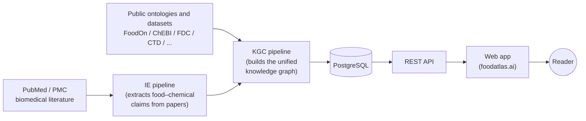

# FoodAtlas

**FoodAtlas** is a knowledge graph platform that links foods to the chemicals they contain and to the diseases those chemicals are associated with. It pulls evidence from the biomedical literature (PubMed/PMC) and from curated public ontologies and datasets (FoodOn, ChEBI, FDC, CTD, MeSH, and others), reconciles them into a single graph of stable entity IDs, and serves the result through a web app.

The goal is to make the relationships hiding across thousands of disjoint sources searchable and citable in one place — so a researcher, clinician, or curious reader can ask "what's in this food?" or "which chemicals correlate with this disease?" and get an answer grounded in primary evidence.

## How the data flows



Two ingestion pipelines (information extraction from literature, and knowledge-graph construction from ontologies) feed a Postgres database. A FastAPI service queries it, and a Next.js web app renders the results.

## What's in this repository

```
.
├── frontend/        # Next.js web app
├── backend/
│   ├── api/         # FastAPI REST service
│   ├── db/          # PostgreSQL schema + ETL loader
│   ├── ie/          # Literature → triplet extraction (BioBERT + LLM)
│   └── kgc/         # Knowledge graph construction
├── infra/
│   ├── local/       # Docker Compose for local development
│   └── aws/         # AWS CDK for production deployment
├── docs/            # Architecture and planning notes
└── scripts/         # Repo-wide setup utilities
```

Every sub-project has its own README with setup, configuration, and usage details.

## Where to go next

| If you want to… | Read |
|---|---|
| Run FoodAtlas locally and develop on it | [DEVELOPER.md](DEVELOPER.md) |
| Deploy or operate the AWS production stack | [infra/README.md](infra/README.md) |
| Understand how triplets are extracted from papers | [backend/ie/README.md](backend/ie/README.md) |
| Understand how the knowledge graph is built | [backend/kgc/README.md](backend/kgc/README.md) |
| See the database schema and ETL loader | [backend/db/README.md](backend/db/README.md) |
| See the API surface | [backend/api/README.md](backend/api/README.md) |

## License

See [LICENSE](LICENSE).
