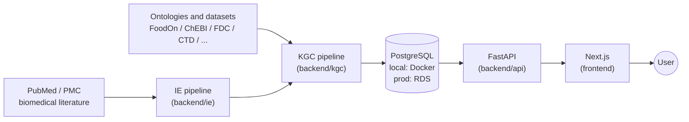

# FoodAtlas

A food knowledge graph platform. This monorepo contains the frontend, backend services, infrastructure-as-code, and data pipelines for ingesting, storing, and serving structured food–chemical–disease relationships.

## Operating Modes

FoodAtlas runs in two distinct modes that share **only the application code** — networking, credentials, and deploy steps diverge by mode.

- **Local development** — Docker Compose Postgres on your laptop, app servers running directly from `uv run python main.py` and `npm run dev`. Use this for day-to-day code changes and tests. See [Running Locally](#running-locally) below.
- **AWS production** — RDS Postgres, ECS Fargate API behind an ALB, S3 for KGC artifacts, deployed via AWS CDK. Use this for live deployments. See [`infra/README.md`](infra/README.md) for the full deploy guide, stack inventory, scripts, and troubleshooting.

The high-level data flow:



## Repository Structure

```
.
├── frontend/                  # Next.js 14 web app (React 18, TypeScript, Tailwind)
├── backend/
│   ├── api/                   # FastAPI REST service (port 8000)
│   ├── db/                    # PostgreSQL schema, ETL loader
│   ├── ie/                    # Information extraction pipeline (LLM-based)
│   └── kgc/                   # Knowledge graph construction pipeline
├── infra/
│   ├── README.md              # Local + AWS infrastructure guide
│   ├── local/                 # Docker Compose + monthly pipeline orchestrator
│   └── cdk/                   # AWS CDK Python project (six stacks)
├── docs/                      # Architecture and planning docs
├── scripts/                   # Repo-wide setup utilities
├── .github/workflows/         # CI pipelines
├── pyproject.toml             # Shared linter/checker configs (ruff, mypy, bandit)
└── .pre-commit-config.yaml    # Git hooks
```

## Running Locally

The local stack is **PostgreSQL → DB data load → FastAPI → Next.js**, all on one machine.

### Prerequisites

- [Docker](https://docs.docker.com/get-docker/) — for PostgreSQL
- [uv](https://docs.astral.sh/uv/) — Python package manager (handles Python install)
- Node.js 20+
- npm

### 1. Clone and install

```bash
git clone https://github.com/AI-Institute-Food-Systems/foodatlas.git
cd foodatlas
./scripts/check-prereqs.sh
```

The setup script auto-installs uv, git hooks, backend dependencies, and frontend dependencies. Node.js and npm must be installed separately.

### 2. Start PostgreSQL

```bash
docker compose -f infra/local/docker-compose.yml up -d
```

This starts a PostgreSQL 16 container on port 5432 with database `foodatlas` (user: `foodatlas`, password: `foodatlas`). Credentials are committed in `docker-compose.yml` deliberately — they only work against your local container.

### 3. Load knowledge graph data

```bash
cd backend/db
uv run python main.py load
```

This drops and recreates the schema from the SQLAlchemy models, then loads KGC parquet output into PostgreSQL. See [`backend/kgc/README.md`](backend/kgc/README.md) for how to generate the parquet files locally, or [`infra/README.md`](infra/README.md) for how to pull them from the production S3 bucket.

### 4. Start the API server

```bash
cd backend/api
uv run python main.py
```

The FastAPI server runs at `http://localhost:8000`. In debug mode (default), API key authentication is skipped.

### 5. Start the frontend

```bash
cd frontend
npm run dev
```

The frontend runs at `http://localhost:3000`. It reads `NEXT_PUBLIC_API_URL` from `frontend/.env.local`; default is `http://localhost:8000`.

### Remote access (SSH tunnel)

If running on a remote dev server, forward both ports from your local machine:

```bash
ssh -L 3001:localhost:3000 -L 8000:localhost:8000 user@your-server
```

Then open `http://localhost:3000` in your local browser.

### Local environment variables

Each sub-project reads its own `.env` file. Defaults work out of the box for local dev.

| Variable              | Default (local)         | Description                                      |
| --------------------- | ----------------------- | ------------------------------------------------ |
| `DB_HOST`             | `localhost`             | PostgreSQL host                                  |
| `DB_PORT`             | `5432`                  | PostgreSQL port                                  |
| `DB_NAME`             | `foodatlas`             | Database name                                    |
| `DB_USER`             | `foodatlas`             | Database user                                    |
| `DB_PASSWORD`         | `foodatlas`             | Database password                                |
| `API_KEY`             | (empty)                 | Bearer token (skipped in debug mode)             |
| `API_CORS_ORIGINS`    | `http://localhost:3000` | Comma-separated allowed origins                  |
| `API_DEBUG`           | `true`                  | Skip API key verification when true              |
| `NEXT_PUBLIC_API_URL` | —                       | Backend API URL (set to `http://localhost:8000`) |
| `NEXT_PUBLIC_API_KEY` | —                       | Backend API key (not needed in debug mode)       |

In **production**, `DB_USER` and `DB_PASSWORD` are injected from AWS Secrets Manager; `API_DEBUG` is `False`; `NEXT_PUBLIC_API_URL` points at the ALB DNS (or eventually a custom domain). See [`infra/README.md`](infra/README.md).

## Running on AWS

For deploying to AWS production — first-time setup, ongoing deploys, scripts, troubleshooting — see **[`infra/README.md`](infra/README.md)**.

## License

See [LICENSE](LICENSE) for details.
