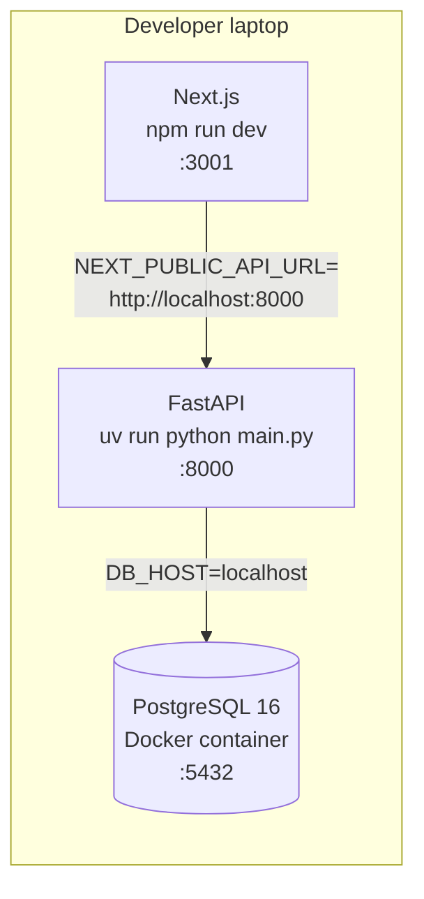
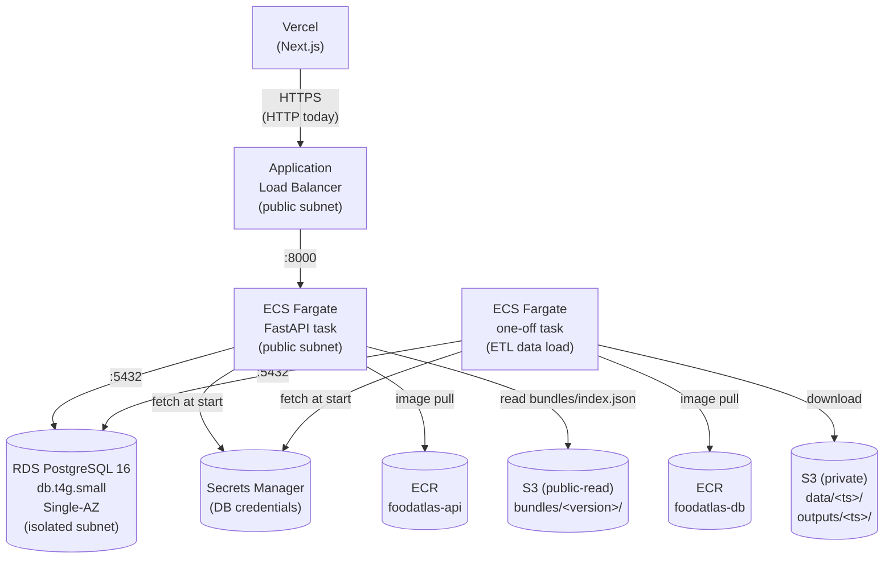
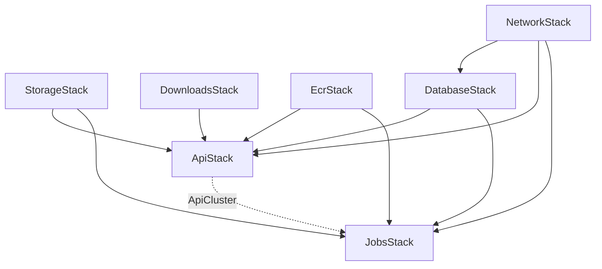

# FoodAtlas Infrastructure

This directory holds everything needed to run FoodAtlas in the two operating modes the project supports:

- **Local development** — A single-machine Docker Compose stack with PostgreSQL, used while writing code and running tests on a developer laptop.
- **AWS production** — A multi-stack AWS CDK deployment (RDS, ECS Fargate, ALB, S3 (private + public-read for releases), ECR, Secrets Manager) that hosts the live API for the Vercel frontend.

The two modes share **zero physical infrastructure**. Local Postgres lives in a Docker container on your laptop; production Postgres is RDS in `us-west-1`. The only thing in common is the Python code in `backend/` and the SQLAlchemy schema in `backend/db/src/models/`. Everything else — credentials, networking, deploy steps — diverges by mode.

---

## Contents

```
infra/
├── README.md              # This file
├── local/                 # Mode: local development
│   ├── README.md          # Local quick-start
│   ├── docker-compose.yml # Local Postgres 16
│   ├── init-db.sql        # Postgres init script (enables pg_trgm)
│   └── scripts/
│       └── run_monthly.sh # Local IE → KGC → DB → S3 orchestrator
└── aws/                   # Mode: AWS production
    ├── README.md          # CDK CLI quick reference
    ├── app.py             # CDK app entry point
    ├── stacks/            # Six stack definitions
    ├── tests/             # Snapshot tests using aws_cdk.assertions
    └── scripts/           # ECS one-off task runners (ETL data load)
```

---

## Mode 1: Local development

The local stack is the path of least resistance for iterating on code. Everything runs on your laptop, no AWS account required.

### Architecture

Arrows show request flow at runtime. Everything runs as a process or container on the developer laptop.


```mermaid
flowchart LR
    subgraph laptop["Developer laptop"]
        next["Next.js<br/>npm run dev<br/>:3001"]
        api["FastAPI<br/>uv run python main.py<br/>:8000"]
        pg[("PostgreSQL 16<br/>Docker container<br/>:5432")]
    end

    next -->|"NEXT_PUBLIC_API_URL=<br/>http://localhost:8000"| api
    api -->|"DB_HOST=localhost"| pg
```

### Bring it up

```
docker compose -f infra/local/docker-compose.yml up -d
cd backend/db && uv run python main.py load
cd backend/api && uv run python main.py
cd frontend && npm run dev
```

The Docker Postgres uses `foodatlas` / `foodatlas` / `foodatlas` for db / user / password — these are committed into `docker-compose.yml` deliberately. The container binds to localhost and is not reachable from the network, so the weak credentials are fine for dev.

### `run_monthly.sh`

A long-running orchestrator that chains the IE → KGC → DB → S3 stages. Used to refresh the knowledge graph from biomedical literature each month. Reads source `.env` files for API keys (`OPENAI_API_KEY`, `NCBI_API_KEY`, `NCBI_EMAIL`) and shells out to the corresponding sub-projects. The S3 upload step calls `backend/kgc/scripts/sync-outputs-to-s3.sh`, which auto-resolves the bucket from `FoodAtlasStorageStack`.

```
bash infra/local/scripts/run_monthly.sh                     # Full run
bash infra/local/scripts/run_monthly.sh --skip-ie           # Reuse existing IE outputs
bash infra/local/scripts/run_monthly.sh --ie-only           # IE only, stop before KGC
```

---

## Mode 2: AWS production

Production runs on AWS and is defined entirely in CDK Python under `infra/aws/`. The infrastructure is split into seven stacks; each is independently deployable but they have constructor dependencies that CDK uses to enforce deploy order.

### Architecture


```mermaid
flowchart TB
    vercel["Vercel<br/>(Next.js)"]
    alb["Application<br/>Load Balancer<br/>(public subnet)"]
    api["ECS Fargate<br/>FastAPI task<br/>(public subnet)"]
    rds[("RDS PostgreSQL 16<br/>db.t4g.small<br/>Single-AZ<br/>(isolated subnet)")]
    secrets[("Secrets Manager<br/>(DB credentials)")]
    s3[("S3 (private)<br/>data/&lt;ts&gt;/<br/>outputs/&lt;ts&gt;/")]
    downloads[("S3 (public-read)<br/>bundles/&lt;version&gt;/")]
    jobs["ECS Fargate<br/>one-off task<br/>(ETL data load)"]
    ecr_api[("ECR<br/>foodatlas-api")]
    ecr_db[("ECR<br/>foodatlas-db")]

    vercel -->|"HTTPS<br/>(HTTP today)"| alb
    alb -->|":8000"| api
    api -->|":5432"| rds
    api -->|"fetch at start"| secrets
    api -->|"image pull"| ecr_api
    api -->|"read bundles/index.json"| downloads
    jobs -->|":5432"| rds
    jobs -->|"fetch at start"| secrets
    jobs -->|"image pull"| ecr_db
    jobs -->|"download"| s3
```

### The seven stacks

| Stack | Responsibility | Resources |
| --- | --- | --- |
| `FoodAtlasNetworkStack` | VPC, subnets, security groups | 1 VPC, 2 AZs, public + isolated subnets, no NAT |
| `FoodAtlasStorageStack` | Private S3 bucket for KGC source data + pipeline artifacts | 1 versioned encrypted bucket with lifecycle rules |
| `FoodAtlasDownloadsStack` | Public-read S3 bucket for released data bundles + `bundles/index.json` manifest | 1 bucket, `s3:GetObject` granted to anonymous principals (listing not granted) |
| `FoodAtlasEcrStack` | Container registries | 2 ECR repos (`foodatlas-api`, `foodatlas-db`), each with `keep-last-10` lifecycle |
| `FoodAtlasDatabaseStack` | Postgres + credentials | RDS db.t4g.small Single-AZ, Secrets Manager secret |
| `FoodAtlasApiStack` | Long-running API service | ECS cluster, task def, service, ALB, log group; reads the downloads bucket for `/download` |
| `FoodAtlasJobsStack` | One-off task runner | Task def + log group + SG (no service) |

The Single-AZ RDS choice means an AZ-level outage requires ~15 minutes to recover from automated backup. Flip `multi_az=True` in `database_stack.py` to upgrade to true high availability.

### Stack dependencies


```mermaid
flowchart TB
    network[NetworkStack]
    storage[StorageStack]
    downloads[DownloadsStack]
    ecr[EcrStack]
    db[DatabaseStack]
    api[ApiStack]
    jobs[JobsStack]

    network --> db
    network --> api
    network --> jobs
    storage --> api
    storage --> jobs
    downloads --> api
    ecr --> api
    ecr --> jobs
    db --> api
    db --> jobs
    api -.->|"ApiCluster"| jobs
```

`JobsStack` reuses the ECS cluster from `ApiStack` — cluster reuse is free and reduces operational surface.

---

## First-time deploy

This is what a fresh AWS account looks like. Skip steps you've already done.

### Prerequisites

- AWS account with administrator-equivalent access (via SSO or IAM user)
- AWS CLI configured: `aws configure sso` (or `aws configure` for static keys)
- Docker daemon running locally (used by image build steps)
- `npm install -g aws-cdk`
- `uv` installed
- `cd infra/aws && uv sync`

### CDK bootstrap (once per account+region)

```
uv run cdk bootstrap aws://YOUR_ACCOUNT/us-west-1
```

This creates the `CDKToolkit` stack which provisions an S3 bucket and an ECR repo that CDK uses for asset publishing.

### Deploy the foundation stacks

```
cd infra/aws
uv run cdk deploy FoodAtlasNetworkStack FoodAtlasStorageStack FoodAtlasDownloadsStack FoodAtlasEcrStack
```

These four have no dependencies on each other and deploy in parallel. `FoodAtlasDownloadsStack` is the public-read bucket that serves released data bundles to the website.

### Build and push the container images

The API and one-off jobs need their Docker images in ECR before the consuming stacks can start tasks. Both push scripts hardcode the account/region/repo URI.

```
./backend/api/scripts/push-to-ecr.sh         # Builds and pushes foodatlas-api:latest
./backend/db/scripts/push-to-ecr.sh          # Builds and pushes foodatlas-db:latest
```

Both scripts pass `--platform linux/amd64` because the Fargate task definitions pin `ecs.CpuArchitecture.X86_64`. They accept an optional positional tag (`./push-to-ecr.sh abc1234`) to push a specific version; default is `latest`.

### Deploy the database

```
uv run cdk deploy FoodAtlasDatabaseStack
```

This provisions RDS, which takes 10–15 minutes. **Billing starts here** — RDS is the largest line item in the stack. The auto-generated master password is stored in AWS Secrets Manager (path defined by `_DB_SECRET_NAME` in `aws/stacks/database_stack.py`); nothing on your laptop ever sees the plaintext.

### Deploy the API and jobs stacks

```
uv run cdk deploy FoodAtlasApiStack FoodAtlasJobsStack
```

`ApiStack` brings up the ALB + ECS service + 1 Fargate task pulling `foodatlas-api:latest` from ECR. `JobsStack` registers the one-off task definition; no tasks run until you invoke them via the helper scripts.

### Publish KGC content and load it into RDS

```
./backend/kgc/scripts/sync-data-to-s3.sh        # One-time per data refresh
./backend/kgc/scripts/sync-outputs-to-s3.sh     # Once per KGC run
cd infra/aws && ./scripts/run-data-load.sh
```

After this completes, the API is serving real data. Test with:

```
curl http://<ALB-dns>/health                    # Returns {"status":"ok"}
curl http://<ALB-dns>/food/metadata?common_name=apple
```

Get the ALB DNS from `aws cloudformation describe-stacks --stack-name FoodAtlasApiStack --query "Stacks[0].Outputs[?OutputKey=='ApiUrl'].OutputValue" --output text`.

---

## S3 layout

`FoodAtlasStorageStack` creates one bucket with two top-level prefixes. Each prefix carries its own version history and `LATEST` pointer, because source data and pipeline outputs evolve at different cadences.

```
s3://<kgcbucket>/
├── data/                                ← source ontologies, refreshed quarterly
│   ├── 20260413T221503Z/
│   │   ├── CDNO/, ChEBI/, CTD/, FDC/, FlavorDB/,
│   │   ├── FoodOn/, HSDB/, MeSH/, PubChem/    (anything in backend/kgc/data/
│   │   └── ...                                 except PreviousFAKG/ and Lit2KG/)
│   └── LATEST                           ← text file with the timestamp string
└── outputs/                             ← KGC pipeline output, refreshed monthly
    ├── 20260413T221503Z/
    │   ├── manifest.json                ← data_version + git_sha + host + user
    │   ├── kg/
    │   │   ├── entities.parquet
    │   │   ├── entity_registry.parquet
    │   │   ├── triplets.parquet
    │   │   ├── relationships.parquet
    │   │   ├── evidence.parquet
    │   │   ├── attestations.parquet
    │   │   ├── attestations_ambiguous.parquet
    │   │   ├── CHANGELOG.md             ← auto-generated diff vs. the previous run
    │   │   ├── SUMMARY.md               ← human-readable run summary
    │   │   ├── checkpoints/             ← debugging sidecars
    │   │   ├── diagnostics/
    │   │   └── intermediate/
    │   └── ingest/
    │       └── (per-source ingestion outputs)
    └── LATEST
```

A separate `FoodAtlasDownloadsStack` bucket holds **public** released bundles, populated by `publish-bundle.sh`:

```
s3://<downloadsbucket>/
└── bundles/
    ├── index.json                     ← manifest the API's /download endpoint reads
    ├── foodatlas-v1.0/
    │   ├── foodatlas-v1.0.zip         ← parquets + CHANGELOG + SUMMARY + README
    │   └── SUMMARY.md                 ← also surfaced standalone for the website
    └── foodatlas-v1.1/
        └── ...
```

**Why split data and outputs.** Source ontologies are 10+ GB and refresh quarterly. KGC outputs are smaller (~hundreds of MB) and refresh monthly. If we bundled them, every monthly KGC run would re-upload the entire source tree.

**LATEST pointers.** Single-line text files containing the timestamp of the most recent run for that prefix. Downstream tooling reads these to resolve "current" without listing the bucket. The `outputs/<ts>/manifest.json` records which `data/<ts>/` was current at the time of the run, so every output version has a traceable upstream data version.

**Versioning is forever.** No lifecycle rule deletes old `data/` or `outputs/` versions — parquet is small enough that long-term retention is not a concern. The bucket also has S3 object versioning enabled as an additional safety net against accidental deletes.

**Excluded from data sync:** `PreviousFAKG/` (downloaded back from S3 — would create a loop), `Lit2KG/` (legacy text-parser outputs no longer used by the pipeline), plus repo housekeeping (`README.md`, `.gitignore`, `download.sh`).

---

## Helper scripts

Two categories: **artifact publishing** (lives next to the artifact being published) and **cloud orchestration** (lives in `infra/aws/scripts/`).

### Artifact publishing

| Script | Action |
| --- | --- |
| `backend/api/scripts/push-to-ecr.sh [tag]` | Build the API Docker image, tag with `[tag]` (default `latest`), push to `foodatlas-api` ECR repo |
| `backend/db/scripts/push-to-ecr.sh [tag]` | Same for the db jobs image (`foodatlas-db`) |
| `backend/kgc/scripts/sync-data-to-s3.sh` | Upload `backend/kgc/data/` to `s3://<bucket>/data/<ts>/`, bump `data/LATEST`. Excludes `PreviousFAKG/`, `Lit2KG/`, repo housekeeping |
| `backend/kgc/scripts/sync-outputs-to-s3.sh` | Upload `backend/kgc/outputs/` to `s3://<bucket>/outputs/<ts>/`, write `manifest.json`, bump `outputs/LATEST` |
| `backend/kgc/scripts/pull-data-from-s3.sh [version]` | Download `data/<latest>/` (or explicit `[version]`) into `backend/kgc/data/` |
| `backend/kgc/scripts/pull-from-s3.sh [version]` | Download `outputs/<latest>/kg/` into `backend/kgc/data/PreviousFAKG/<ts>/` (the baseline for the next KGC run) |
| `backend/kgc/scripts/merge_bioactivity_delta.py --base <run dir> --out <dir>` | Three-way merge of the bioactivity delta (`20260731T082453Z` − `20260727T100828Z`) onto a newer KGC run; hard-fails on conflicts. See [Load a new KGC run](#load-a-new-kgc-run-onto-prod-until-kgc-emits-bioactivity) |
| `backend/kgc/scripts/publish-bundle.sh <version> <summary-file> [--kgc-run <id>] [--release-date <YYYY-MM-DD>]` | Package a private KGC run as a public release bundle, upload to `s3://<downloads>/bundles/foodatlas-<version>/`, refresh `bundles/index.json` |
| `backend/kgc/scripts/_lib.sh` | Shared bash helpers (CFN-output lookup, version pointer handling) used by the four sync/pull/publish scripts |

### Cloud orchestration

| Script | Action |
| --- | --- |
| `infra/aws/scripts/run-data-load.sh [version]` | Invoke the ETL loader against `s3://<bucket>/outputs/<latest>/kg/` (or `[version]`). Drops and recreates the schema, then loads. Tails logs |
| `infra/aws/scripts/_lib.sh` | Shared bash helpers: read CFN outputs, build network config, invoke + wait + tail |

---

## Common workflows

### Ship an API code change

```
# Local: write code + tests
cd backend/api && uv run pytest

# Build + push the new image
./backend/api/scripts/push-to-ecr.sh $(git rev-parse --short HEAD)

# Deploy the API stack pinning the new tag (immutable)
cd infra/aws
uv run cdk deploy FoodAtlasApiStack -c api_image_tag=$(git rev-parse --short HEAD)
```

ECS performs a rolling deploy. The default `min_healthy_percent=50%` with `desired_count=1` means there's a brief window (~30s) where the API is unavailable during rollover. Acceptable at current scale; bump `desired_count=2` for zero-downtime.

### Add a database column

```
# Update SQLAlchemy model
vim backend/db/src/models/entities.py

# Test locally — drops and recreates the schema, then reloads from parquet
cd backend/db
uv run python main.py load

# Commit, deploy through CD (image only; data reload is manual):
./backend/db/scripts/push-to-ecr.sh $(git rev-parse --short HEAD)
cd infra/aws && uv run cdk deploy FoodAtlasJobsStack -c db_image_tag=$(git rev-parse --short HEAD)

# Trigger a data reload against the new schema
./scripts/run-data-load.sh
# Then deploy the API code that depends on the new column
```

The reload must run **before** the API code that depends on the new column. Reverse order causes 500s. Since `load` drops and recreates tables, expect ~minutes of downtime.

### Promote dev to main (schema + data change)

Prod has no migrations: `db load` drops and recreates the schema, so a release that changes tables is a short outage no matter how it is sequenced. Announce the window first (measure it from the last staging reload's task log), then in one sitting:

```
# 0. main must already be an ancestor of dev, or the release PR conflicts
git merge-tree --write-tree origin/main origin/dev    # must be clean; if not, merge main INTO dev first (merge commit, not squash)

# 1. Release PR, merged with a merge commit. Vercel builds prod immediately; cd.yml starts.
gh pr create --base main --head dev --title "release: promote dev to main"

# 2. As soon as cd.yml's "Deploy non-API stacks" step is done (JobsStack has the new DB image),
#    load prod. Don't wait for the API step — the schema has to land before the new API is healthy.
cd infra/aws && ./scripts/run-data-load.sh <version>      # version is REQUIRED for a new dataset; no-arg = outputs/LATEST

# 3. cd.yml's smoke step fails while the load is running (real-data endpoints are empty). Re-run it once the load exits 0:
gh workflow run cd.yml --ref main

# 4. Repoint LATEST so the no-arg reload keeps doing the right thing
echo -n <version> | aws s3 cp - s3://<KgcBucketName>/outputs/LATEST
```

Then verify by hand (`/metadata/statistics` counts, one row from each data endpoint, `/v1/foods` with a public key, the landing page and one entity page of each type) before touching anything else. Rollback handles: `vercel promote <previous dpl_>`, `cdk deploy FoodAtlasApiStack -c api_image_tag=<old tag>`, `run-data-load.sh <old LATEST value>`.

### Load a new KGC run onto prod (until KGC emits bioactivity)

**Background (2026-09-18).** Prod ran Kaichi's lit2kg injection runs (`outputs/<ts>`) until 2026-09-17, when it was rebuilt from `outputs/20260731T082453Z` (originally published under the name `staging-bioactivity`; copied to a timestamp 2026-09-18) — bioactivity + PTFI, cut 2026-07-31 from run `20260727T100828Z`. That swap dropped the Aug 21 / Aug 28 / Sep 15 injections. The two lineages never contained each other: `kgc-production` writes the six core parquet files but not the bioactivity ones (`attestations_bioactivity`, `bioassays`, `bioactivity_disease`, `bioactivity_disease_targets`, `food_chemical_efficacy`, r5/r6 in `relationships`), and `backend/db` treats those files as optional — so loading a raw injection run silently drops bioactivity from prod. Both deltas vs `20260727T100828Z` are purely additive and disjoint (the only shared-record change is appending `attestation_ids`), so they merge without conflict. Prod has served the merged dataset `20260918T100923Z` (= `20260915T081827Z` + bioactivity delta) since 2026-09-18.

**Every new run until KGC emits bioactivity itself:** merge, then load. `backend/kgc/scripts/merge_bioactivity_delta.py` applies the bioactivity delta (`20260731T082453Z` − `20260727T100828Z`) onto the new run and exits non-zero on any shared-row mismatch, entity-id collision with the reserved range `e227381+`, dangling reference, or row count ≠ base + delta − ancestor. Never `run-data-load.sh <raw run>` and never point `outputs/LATEST` at a raw run.

```
# 1. Pull the new run next to the two fixed inputs (ancestor + delta pull once and stay)
cd backend/kgc
./scripts/pull-from-s3.sh <new run>              # → data/PreviousFAKG/<new run>/
./scripts/pull-from-s3.sh 20260727T100828Z       # ancestor (once)
./scripts/pull-from-s3.sh 20260731T082453Z    # delta    (once)

# 2. Merge. Report must show every table as base + delta − ancestor; verify() exits non-zero otherwise.
uv run python scripts/merge_bioactivity_delta.py --base data/PreviousFAKG/<new run> --out outputs/kg-merged

# 3. Upload as a new version. sync-outputs-to-s3.sh only uploads outputs/kg, so either point it at
#    the merge (--out outputs/kg) or upload by hand and write the manifest yourself:
VERSION=$(date -u +%Y%m%dT%H%M%SZ)
aws s3 sync outputs/kg-merged/ s3://<KgcBucketName>/outputs/$VERSION/kg/
printf '{"version":"%s","merged_from":["<new run>","20260731T082453Z"],"ancestor":"20260727T100828Z","git_sha":"%s","host":"%s","user":"%s"}' \
  "$VERSION" "$(git rev-parse --short HEAD)" "$(hostname)" "$USER" | aws s3 cp - s3://<KgcBucketName>/outputs/$VERSION/manifest.json

# 4. Load it (~15 min outage) and repoint LATEST
cd ../../infra/aws && ./scripts/run-data-load.sh $VERSION
echo -n $VERSION | aws s3 cp - s3://<KgcBucketName>/outputs/LATEST
```

Verify with `/metadata/statistics`: `bioactivities` (21) and `bioactivity_measurements` (1,557,037) must be unchanged from before the load; `connections` grows by the new run's r1 pairs plus the r2/r3/r4 edges of any chemicals those pairs connect for the first time. Rollback is `run-data-load.sh <previous LATEST value>`.

**Public download bundle (decided 2026-09-18: bundles carry bioactivity + PTFI, same graph as the site).** The merge copies `base`'s `CHANGELOG.md`, which only describes the injection run's own delta — regenerate it against the previous *published* run before bundling, then publish from the merged version, never from the raw run:

```
# 5. Regenerate CHANGELOG.md for the merged dataset vs the run behind the last bundle (`kgc_run` in bundles/index.json)
mkdir -p /tmp/report-data/PreviousFAKG && cp -r data/PreviousFAKG/<previous published run> /tmp/report-data/PreviousFAKG/
uv run python -c "
from src.pipeline.report.load_old import load_old_kg; from src.pipeline.report.runner import run_diff; from src.pipeline.report.format import format_changelog
open('outputs/kg-merged/CHANGELOG.md','w').write(format_changelog(run_diff(load_old_kg('/tmp/report-data'), 'outputs/kg-merged')))"
aws s3 cp outputs/kg-merged/CHANGELOG.md s3://<KgcBucketName>/outputs/$VERSION/kg/CHANGELOG.md

# 6. Publish (release_notes/SUMMARY-<v>.md = two-line blurb the site shows)
./scripts/publish-bundle.sh v<next> release_notes/SUMMARY-v<next>.md --kgc-run $VERSION --release-date $(date -u +%F)
```

`publish-bundle.sh` without `--kgc-run` reads `outputs/LATEST`, which after step 4 is the merged version — fine, but pass it explicitly so the bundle's `kgc_run` is unambiguous. (`main.py report` diffs against the lexically-last `PreviousFAKG/` dir — keep only timestamped dirs there, never a named one.)

**Constraints on the injection runs while this merge is in use** (the script refuses to run if either breaks — tell the platform team before changing them):

- Runs stay additive vs `20260727T100828Z`: no entities removed or renamed, no attestations rewritten; existing triplets may only gain `attestation_ids`.
- Entity ids minted by the run stay below `e227381`. The run is at `e227380`; `e227381–e228466` hold the 21 bioactivity concepts and the re-based PTFI foods/chemicals.

**Retiring the merge — what the KGC run has to produce (Kaichi).** The pipeline code that emits the bioactivity parquet already exists on `dev` (PR #278, `570d1f2`: `backend/kgc/src/pipeline/ingest/adapters/bioactivity.py` + `src/pipeline/triplets/bioactivity/`); it is not on `main` until the next dev→main promotion. What's missing on `kgc-production` is the input and the wiring:

1. Run the pipeline from code that includes PR #278 (`dev` now, `main` after promotion).
2. Put the raw inputs at `backend/kgc/data/Bioactivity/` — the 8 CSVs from Pranav: `bioactivity_entities.csv`, `food_bioactivity_triplets.csv`, `chemical_bioactivity_triplets.csv`, `bioactivity_metadata.csv`, `bioassay_metadata.csv`, `food_chemical_efficacy.csv`, `disease_bioactivity_triplets.csv`, `bioactivity_disease_metadata.csv`. They are not in the S3 `data/` snapshot (`data/LATEST` = `20260414T020022Z` has no `Bioactivity/`); run `sync-data-to-s3.sh` once they're in place so the snapshot carries them.
3. Apply PTFI after the build with `backend/kgc/scripts/merge_ptfi_delta.py` (reads `/mnt/share/kaichixie/FA_monorepo/new_datasets/DataForKG/ptfi`), or fold it into the pipeline as an adapter. A run is complete only with both.
4. Diff `outputs/kg/` against `outputs/20260731T082453Z/kg/`: the six bioactivity files must be present, `relationships.parquet` must carry r5/r6, and `attestations_bioactivity` must be referenced from r5/r6 `attestation_ids`.
5. Upload with `sync-outputs-to-s3.sh` as usual. Once such a run loads with `run-data-load.sh <ts>` and `/metadata/statistics` reports `bioactivities: 21` and the measurement count, delete `merge_bioactivity_delta.py`, its test, and this section (`_merge_common.py` stays — `merge_ptfi_delta.py` uses it).

Entity ids minted by that native run will differ from today's `e227381+` — that's fine; it replaces the merged dataset wholesale and the reserved-range constraint above no longer applies.

### Roll back the data to a previous KGC run

```
# List available versions
aws s3 ls s3://<bucket>/outputs/

# Load a specific timestamp
cd infra/aws
./scripts/run-data-load.sh 20260315T140000Z
```

The loader is destructive (rewrites tables), so this fully replaces the current data. The previous version's parquet stays in S3 forever.

### Roll back the API to a previous image

```
cd infra/aws
uv run cdk deploy FoodAtlasApiStack -c api_image_tag=<previous-sha>
```

ECS rolling deploy, ~5 minutes. Image lifecycle keeps the last 10 in ECR.

---

## Troubleshooting

### `Cannot delete export ... in use`

You renamed a CDK resource that's referenced by another stack. CloudFormation refuses to remove the cross-stack export until consumers stop importing it. Two-phase fix:

1. Keep the old resource alongside the new one in the producer stack. Use `self.export_value(old_resource.attr, name="<exact-old-export-name>")` to pin the old export.
2. Deploy the producer first (creates the new resource and preserves the old export), then redeploy consumers (they switch to the new export).
3. Once nothing imports the old export, remove the old resource and pinned exports from the producer in a follow-up deploy.

### ECR push fails with `name unknown`

The ECR repo doesn't exist yet. `cdk deploy FoodAtlasEcrStack` first.

### ECS task fails to pull image with `manifest unknown`

You're trying to deploy `ApiStack` or `JobsStack` before pushing the corresponding image. Push first.

### Stack deploy hangs at "service waiting to stabilize"

ECS service is waiting for the task to pass health checks. The container might be crashing on startup. Check `aws logs tail /aws/ecs/<log-group>` for the actual error. Common causes: wrong DB host, bad secret name, container can't reach RDS due to security group misconfiguration.

### `aws sso login` says token expired

```
aws sso login
```

SSO sessions last 12 hours. CDK and AWS CLI both fail with cryptic auth errors when expired.

### Mixed content errors in browser when calling API from Vercel

ALB is HTTP-only. Browsers block HTTPS pages from making HTTP requests. You need ACM + Route 53 + a 443 listener on the ALB. Tracked as a deferred plan item.

### Orphan bucket left after a rename

`RemovalPolicy.RETAIN` keeps the physical bucket when the CDK resource is deleted. Manually clean up:

```
aws s3 rb s3://<orphan-bucket-name>          # If empty
aws s3 rb s3://<orphan-bucket-name> --force  # If you also want to delete contents (DESTRUCTIVE)
```

### Stack drift (something CDK manages was changed manually)

```
aws cloudformation detect-stack-drift --stack-name FoodAtlasFooStack
aws cloudformation describe-stack-resource-drifts --stack-name FoodAtlasFooStack
```

Fix by either reverting the manual change in the AWS console, or `cdk destroy` + `cdk deploy` to recreate from CDK state. Don't edit AWS resources by hand if you can help it — drift makes deploys unpredictable.

---

## What's deferred

- **HTTPS / custom domain.** ALB currently listens on port 80 only. ACM cert + Route 53 + 443 listener is a small CDK addition once a domain is wired up.
- **CD pipelines.** Today everything is `cdk deploy` from a developer laptop. A GitHub Actions workflow with OIDC role assumption can build images, push to ECR, and deploy on merge. App-code CD is the highest-ROI first step; infra CD should keep a manual approval gate.
- **Multi-AZ RDS.** Currently Single-AZ. One flag flip (`multi_az=True` in `database_stack.py`) to upgrade when the project warrants it.
- **AWS-hosted KGC pipeline.** KGC currently runs on a developer machine and uploads outputs via the sync scripts. Future option: AWS Batch or Step Functions for fully managed runs.

---

## Reference

- CDK Python API docs: https://docs.aws.amazon.com/cdk/api/v2/python/
- CDK construct library: https://constructs.dev/
- AWS CLI command reference: https://docs.aws.amazon.com/cli/latest/reference/
- For CDK CLI commands (synth, diff, deploy, destroy): see `aws/README.md`
